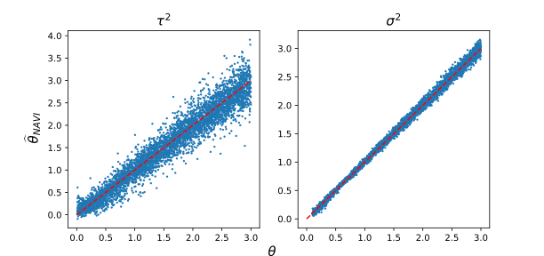
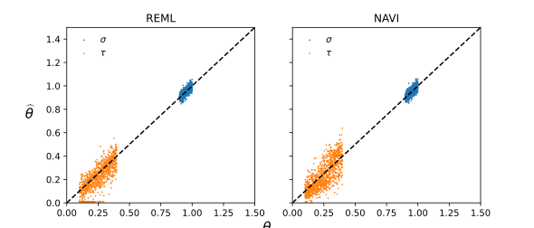

# NAVI (Neural Accelerated Variance-component Inference)

**N**eural **A**ccelerated **V**ariance-component **I**nference (NAVI, _나비_) is a neural estimator for inferring variance components of complex traits in large scale biobanks.

NAVI trains a graph neural network using simulated data from succinct tree sequences.

Once trained, it can instantaneously infer variance components of thousands of traits within seconds on a single GPU.

## Examples
	<center></center>
	<center>True parameter versus NAVI estimate across 5000 replicates. It takes 51ms on a single Nvidia A40 GPU.</center>

	<center></center>
	<center>REML versus NAVI estimates across 1000 replicates. NAVI is as precise as REML.</center>


## Dependencies

NAVI's neural network uses a `jax` backend and is implemented in `flax`.
```bash
pip install jax flax
```

Training data is simulated from succinct tree sequences implemented in `tskit`.
```bash
pip install tskit
```
